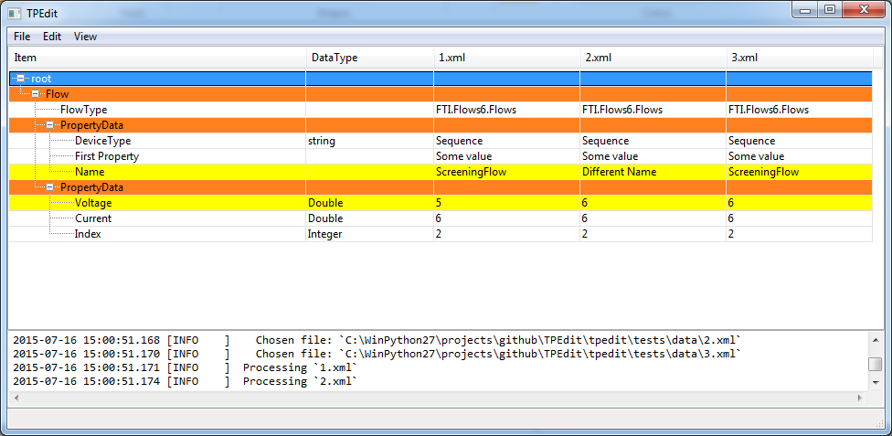
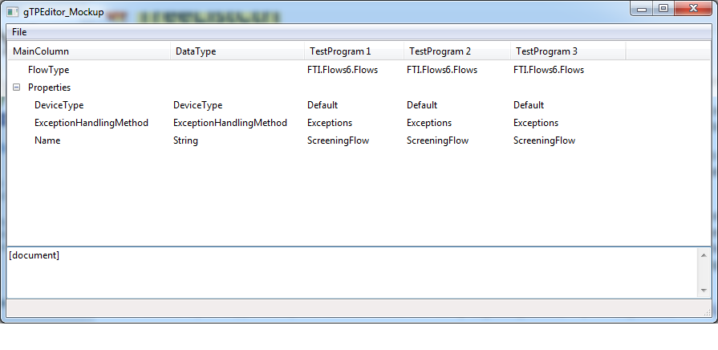

======
TPEdit
======
A Test Program (TP) Editor and Diff tool for test programs made by
FTI Studio.

Build Status
------------

+-----------+----------+-----------+------+
| Travis-CI | AppVeyor | Coveralls | PyPI |
+===========+==========+===========+======+
||travis-ci|||appveyor|||coveralls|||PyPI||
+-----------+----------+-----------+------+

+------------------------------------+
|            Downloads               |
+=========+=========+========+=======+
||DLTotal|||DLMonth|||DLWeek|||DLDay||
+---------+---------+--------+-------+

Contents
--------

+ `Build Status`_
+ `Contents`_
+ `Summary`_
+ `Features`_
+ `Downloads`_
+ `Notes`_

  + `Why Python 2.7?`_
  + `Future Plans`_

Summary
-------
A Test Program (TP) Editor and Diff tool for test programs made by
FTI Studio. FTI (Focused Test, Inc., http://focusedtest.com/) is a
semiconductor ATE supplier specializing in discrete power devices.

It can compare any number of files, as long as the files all have the same
general structure.

|example1|

Features
--------
+ Cross-Platform GUI via wxPython
+ Diff and work on any number of files at once.

Downloads
---------
You can download the source code, a Python wheel, or even
a 'compiled' executable from github (see `Releases
<https://github.com/dougthor42/TPEdit/releases>`_). You can also get the
Python wheel from `PyPI  <https://pypi.python.org/pypi/TPEdit>`_.

Notes
-----

Why Python 2.7?
~~~~~~~~~~~~~~~
I didn't want to release this with Python 2.7. I feel that all new projects
should be released with 3.4 or above, but wxPython Phoenix (the Python3
verison of wxPython) has a slightly different TreeListCtrl view which
I don't like.

Notice how the spacing between lines is much larger:

|py3_treelistctrl|

I haven't been able to figure out how to get it to look the way I want, so
I've kept the project on Python2.

Future Plans
~~~~~~~~~~~~

+ File editing: use TPEdit to directly edit the Test Program files.
+ Value propagation: send an element's value to all open files.
+ Better Differencing: Allow files that have different structures to be
  diff'd properly - with matching of tests and whatnot.

.. |travis-ci| image:: https://api.travis-ci.org/dougthor42/TPEdit.svg?branch=master
  :target: https://travis-ci.org/dougthor42/TPEdit
  :alt: Travis-CI (Linux, Max)

.. |appveyor| image:: https://ci.appveyor.com/api/projects/status/github/dougthor42/tpedit?branch=master&svg=true
  :target: https://ci.appveyor.com/project/dougthor42/tpedit
  :alt: AppVeyor (Windows)

.. |coveralls| image:: https://coveralls.io/repos/dougthor42/TPEdit/badge.svg?branch=master
  :target: https://coveralls.io/r/dougthor42/TPEdit?branch=master
  :alt: Coveralls (code coverage)

.. |PyPI| image:: http://img.shields.io/pypi/v/TPEdit.svg?style=flat
  :target: https://pypi.python.org/pypi/TPEdit/
  :alt: Latest PyPI version

.. |DLMonth| image:: http://img.shields.io/pypi/dm/TPEdit.svg?style=flat
  :target: https://pypi.python.org/pypi/TPEdit/
  :alt: Number of PyPI downloads per Month

.. |DLTotal| image:: http://img.shields.io/pypi/d/TPEdit.svg?style=flat
  :target: https://pypi.python.org/pypi/TPEdit/
  :alt: Number of PyPI downloads

.. |DLWeek| image:: http://img.shields.io/pypi/dw/TPEdit.svg?style=flat
  :target: https://pypi.python.org/pypi/TPEdit/
  :alt: Number of PyPI downloads per week

.. |DLDay| image:: http://img.shields.io/pypi/dd/TPEdit.svg?style=flat
  :target: https://pypi.python.org/pypi/TPEdit/
  :alt: Number of PyPI downloads per day

